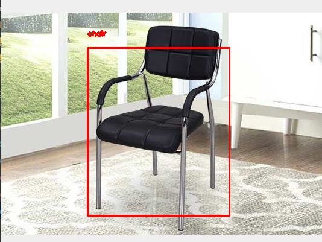

# Object Detection Using YOLO

Yolo is a Deep Learning algorithm which is used to perform object detection in images or real time videos.

In this project I created a package using which you can easily add object detection functionalities in any of your application.

As YOLO is very Dense Neural Network, it needs lots of computing power to execute. Therefore I will suggest to use GPU while running these programs.

### Link To the Repository: [object-detection-using-YOLO](https://github.com/hrik24-git/object-detection-using-YOLO)

### **Prerequisite for this project** -
  * **OpenCV** - This is a Python Package used for Computer Vision Applications.
  * **coco.names** - This file contains the label names. I included this file in the repository.
  * **yolo3.weights** - This file contains the weights that will be required to generate a neural network model. You can download it from https://pjreddie.com/darknet/yolo/
  * **yolo3.cfg** - This file contains the architecture of the neural network.
  * **Input Shape** - There are different input shape of images for different type of architecture of Yolo model. You have to check that what is the input shape for your yolo model.

**Note** - I did not include ```yolo3.weights``` and ```yolo3.cfg``` files in this repository. You can download those files from https://pjreddie.com/darknet/yolo/

### What's in this project -

In this repository there is a folder named ```detection```. ```detection.py``` is a main file
in which the Object Detection code is written in OOPs format. There is a class ```Yolo``` which
performs the task of detection.

Yolo class from this repository needs parameters like follows -

* ```weights_path``` - Pass the path of ```yolo3.weights``` file.
* ```conf_path``` - Pass the path of ```yolo3.cfg``` file.
* ```label_path``` -  Pass the path of ```coco.names``` file.
* ```yolo_shape``` - Pass the value of input shape for particular YOLO model of which weights you passed
* ```threshold_confidence``` - Pass the Threshold Confidence. Detected objects has the confidence above the threshold confidence value. By Default it is 0.95.

These are the parameters that need to pass to ```Yolo``` class while creating its object.

**The Yolo class contains following functions** -

*   ```detect_objects(image)``` - This function is used to detect and locate the objects in the image. We have to pass
the image array with BGR Format. (You can also use the OpenCV's ```cv2.imread()``` function to read the image and
then pass it to the function). This function returns a Dictionary having object name as key and
its location in image as value.

    Returned dictionary of this function-
    ```python
    {'person': [524, 315, 155, 428], 'dog': [723, 456, 144, 169]}
    ```

    Here, in the returned dictionary keys are the detected objects and the value is a list of
    location of the object in that image. List has X co-ordinate of center, Y co-ordinate of center, Width and Height of object Respectively

* ```draw_objects(image, object_location)``` - This function takes the same image and the object-location dictionary as a
argument. It returns the new image with drawn bounding boxes over the detected objects.

    Returned Image -

    


### How to use this in Project?

I created two demo projects [detection-from-image](https://github.com/hrik24-git/object-detection-using-YOLO/blob/master/detection-from-image.py) and [real-time-detection](https://github.com/hrik24-git/object-detection-using-YOLO/blob/master/real-time-detection.py)
which will give you an idea that how can you use this project.

```detection-from-image.py``` file will apply object detection on images.

```real-time-detection.py``` file will detect objects using the webcam of your PC.

